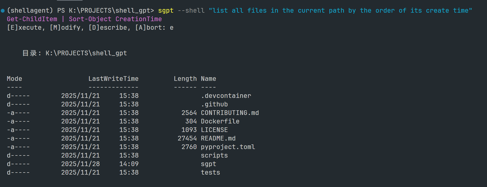
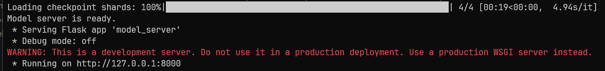
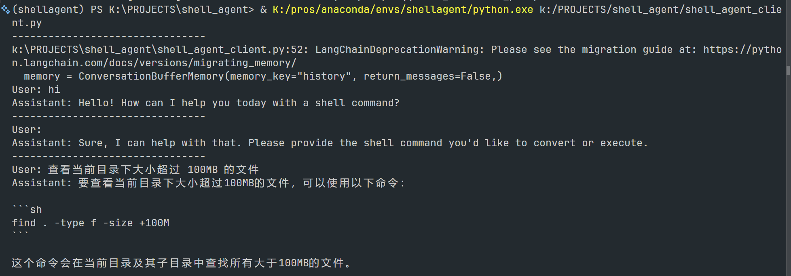

### 周报 2025.12.8-2025.12.14
#### 陈嘉乔 2022060909001

#### 本周的工作
1. 调用 deepseek API 在本地成功复现了sgpt
学习shell-gpt项目的组成结构等

2. 下载Qwen2.5:7b模型，实现了一个基于Flask的HTTP服务器，用于托管Qwen-7B语言模型。
主要工作包括：
    1. 加载Qwen2.5:7B-instruct模型的tokenizer和模型，使用4-bit量化（BitsAndBytesConfig）以优化内存使用。实测本地能跑（RTX3070Ti-laptop）
    2. 配置模型为推理模式（eval），支持设备映射和内存限制。
    3. 提供/generate POST端点，接收用户提示（prompt），生成文本响应。使用模型的generate方法，设置温度、top_p等参数控制生成质量。
    4. 服务器运行在本地127.0.0.1:8000端口。
    
3. 实现了一个命令行客户端，作为shell助手，使用LangChain框架与上述服务器交互。
主要工作包括：
    1. 定义QwenHTTP类，继承LangChain的LLM接口，通过HTTP请求调用服务器的生成端点。
    2. 加载外部提示模板（从prompts/shell_assistant.prompt），构建对话链，包括记忆（ConversationBufferMemory）和提示模板。
    3. 运行CLI循环，接收用户输入，生成shell命令建议，并维护对话历史。
    4. 集成RunnablePassthrough和链式调用，实现自然语言到安全shell命令的转换。
    

#### 下周的计划
1. 目前的 memory 非结构化、非持久化、不可回溯，改为使用SQLite，构建数据库存储
2. 构建(自然语言需求, 标准命令, 错误案例)的向量数据库，学习rag相关知识
