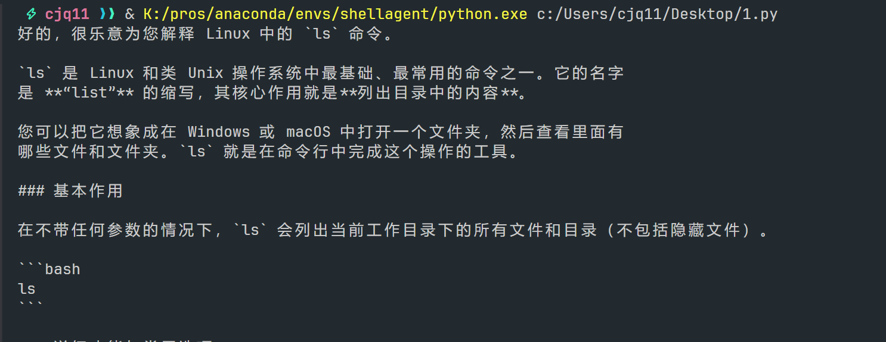

### 周报 2025.11.17-2025.11.21
#### 陈嘉乔 2022060909001

#### 本周的工作
本周主要进行了前期调研与工具学习，为后续开发打下基础。
1. 初步学习**LangChain**框架
    - 本周主要学习了 LangChain 在调用大模型时的基本工作流程，并通过简单的示例代码掌握了以下技术点：

    - 了解 LangChain 的核心组件结构，包括
        - LLM 类
        - PromptTemplate

    - 尝试编写了简单的代码，测试了如下功能：
        - 通过 PromptTemplate 构建模板，例如：“将用户请求转换为 Linux 命令：{instruction}”
        - 使用 LLMChain 调用模型，让其基于模板生成回复

    - 初步理解了 LangChain 对输入输出的封装方式以及它在构建自然语言处理流程时的优势：LangChain可以把对大模型的调用拆分成多个模块化的组件，开发的时候可以直接用更高层的抽象逻辑直接处理上下文传递、记忆、提示词组合等等工作
    - 在b站找到LangChain课程 https://www.bilibili.com/video/BV1nDMJzbEGm?spm_id_from=333.788.videopod.episodes&vd_source=6f579318e6ad547b26223fca0db7f46b&p=6 进行初步学习

2. **LangChain**的安装与使用
    - 创建并激活conda环境 
    ```
    conda create --name shellagent python=3.10
    conda activate shellagent
    ```
    - 使用pip安装LangChain主框架与扩展组件和openai官方SDK
    ```
    pip install langchain
    pip install langchain-community
    pip install openai
    ```
    - 测试时使用了deepseek API，DeepSeek API 使用与 OpenAI 兼容的 API 格式，通过修改配置，可以使用 OpenAI SDK 来访问 DeepSeek API，或使用与 OpenAI API 兼容的软件。
    
    ```
    from langchain_core.prompts import PromptTemplate
    from langchain_openai import ChatOpenAI
    llm = ChatOpenAI(
        model="deepseek-chat",
        api_key="...",
        base_url="https://api.deepseek.com",
        temperature=0.3,
    )
    template = """
    请回答用户的问题。
    
    用户问题：{query}
    """
    prompt = PromptTemplate(
        input_variables=["query"],
        template=template,
    )
    chain = prompt | llm
    resp = chain.invoke({"query": "解释一下Linux中ls命令的作用"})
    print(resp.content)
    ```
    - 结果：
    - `chain = prompt | llm` 这个用法是LangChain的一种链式组合写法，把prompt和llm连接起来，构成一条完整处理链。
    - 此外，LangChain还提供了用于处理llm输出的Parser，可以把模型返回的内容转换成更易于程序处理的格式。例如将回复整理成纯文本等。例如在本项目中：大模型可能会根据用户的输入给出一段自然语言的回复，例如：
    ```
    你可以使用以下命令查看每个CPU core的使用情况：
    mpstat -P ALL 1
    ```
    但是在使用时希望程序只得到：`mpstat -P ALL 1`，此时就可以用Parser来解决。

2. 在 GitHub 上找到相关开源项目 shell-gpt，对其基本功能和项目结构进行了简单浏览。
    重点关注其CLI调用链路。通过分析其代码目录初步理解了项目内部如何组织模型、命令生成、交互式执行等功能
    
    重点阅读了主入口文件app.py的执行流程，包括Typer对CLI参数的解析、不同模式下选择不同Handler的流程，对其整体架构有了初步的理解。
    app.py是整个命令行工具的入口，它主要负责接收用户输入、决定使用哪个逻辑、然后把任务交给对应的Handler。 
    app.py的整体流程：
    1.	解析命令行输入：程序启动后，首先解析用户在命令行输入的所有参数，这些参数会决定整条执行路径。 
    2.	处理输入来源：如果用户是管道输入，程序会把这段内容当成 prompt 的前缀
    3.	决定执行模式：根据参数不同，程序会进入不同模式
        -	repl模式：进入持续对话、持续输入输出的循环。 
        -	chat模式：把对话记录作为上下文继续回答，并保存新消息。 
        -	普通模式：单轮输入、单轮回答。 
        -	shell命令模式：自动根据用户需求生成 shell 命令。 
    这几个模式是互斥的，只能选择其中一个。
    4.	选择合适的系统角色 根据用户使用的模式，程序会自动切换不同的 system prompt，比如： 生成 shell 命令时，角色变为“命令行助手” 解释命令时，角色变为“命令解释器” 只输出代码时，角色变为“代码生成助手” 这一点确保模型的输出更准确。
    5.	如果用户启用了 function calling，程序会加载预定义的函数 schema，并把它们一并传给模型接口。 
    6.	调用对应 Handler 处理任务 不同模式由不同 Handler 接管，例如： DefaultHandler, ChatHandler, ReplHandler，这些 Handler 会负责构建 prompt、调用模型 API等。
    7.	如果用户开启了 shell 模式并启用了交互，程序会在生成命令之后弹出一个无线循环，让用户选择执行命令、修改命令、解释命令、放弃执行
    8.	输出结果并结束（非shell交互）


#### 下周的计划
1. 继续学习LangChain，学习其核心组件在项目中的组合方式，包括prompt构建、记忆模块等，并尝试上手实现一个最小化的demo
2. 在本地尝试复现shell-gpt
3. 编写进度计划表