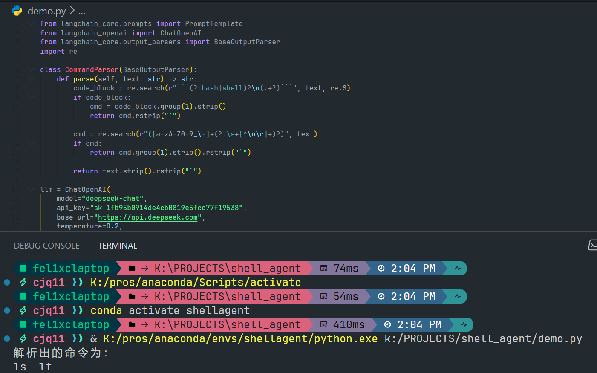

### 周报 2025.11.24-2025.11.28
#### 陈嘉乔 2022060909001

#### 本周的工作

本周围绕 LangChain 的进一步学习、shell-gpt 源码结构分析，以及初步实现最小可用 Demo 展开，主要完成了以下内容。

本周继续深入学习 LangChain 的核心组件，并将其与目标结合进行尝试。

1. LangChain 核心组件的深入学习与实践
- 本周主要研究了 LangChain 的运行链路组合方式，并重点学习了以下内容：
    - PromptTemplate 的多段组合：了解如何构建包含系统指令、用户输入和变量占位符的复杂模板。
    - LCEL（LangChain Expression Language）链式组合写法：进一步理解 prompt | llm | parser 的执行逻辑。
    - Memory 模块的初步学习：测试了 ConversationBufferMemory 和 ConversationSummaryMemory，理解其适用场景，并初步尝试将其接入 Demo。

在此基础上，本周搭建了一个简化的 Demo：
- 用户输入自然语言 -> LangChain Prompt -> DeepSeek/LLMChain 生成命令 -> Parser 提取命令 -> 返回给用户。
- Parser: 本demo中的parser实现了从混杂的自然语言中提取出干净且可以执行的命令字符串。
    逻辑顺序：
    1. 如果有代码块，直接取内容。
    2. 否则尝试从自然语言中提取出“第一个命令模式”。
    3. 如果还是没有，返回原文本（兜底）。

- 通过该实验，我验证了项目核心的可行性。


```
from langchain_core.prompts import PromptTemplate
from langchain_openai import ChatOpenAI
from langchain_core.output_parsers import BaseOutputParser
import re

class CommandParser(BaseOutputParser):
    def parse(self, text: str) -> str:
        code_block = re.search(r"```(?:bash|shell)?\n(.+?)```", text, re.S)
        if code_block:
            cmd = code_block.group(1).strip()
            return cmd.rstrip("`")

        cmd = re.search(r"([a-zA-Z0-9_\-]+(?:\s+[^\n\r]+)?)", text)
        if cmd:
            return cmd.group(1).strip().rstrip("`")

        return text.strip().rstrip("`")

llm = ChatOpenAI(
    model="deepseek-chat",
    api_key="sk-1fb95b0914de4cb0819e5fcc77f19538",
    base_url="https://api.deepseek.com",
    temperature=0.2,
)

template = """
你是一名专业的 Linux 命令行助手。你的任务是根据用户需求生成一个可以直接执行的终端命令。
如果需要解释，请把解释放在命令之外。

用户需求：{query}

请给出最合适的命令。
"""

prompt = PromptTemplate(
    input_variables=["query"],
    template=template,
)

# 链式组合

parser = CommandParser()
chain = prompt | llm | parser

if __name__ == "__main__":
    user_query = "查看当前目录下所有文件，并按修改时间倒序排列"
    
    result = chain.invoke({"query": user_query})
    
    print("解析出的命令为：")
    print(result)

```

2. Shell-gpt的学习
- 本周在进一步阅读 shell-gpt 的源码过程中，我重点关注了其运行流程中涉及的内部组件与处理逻辑，并对多个核心模块进行了深入分析。

- 在命令生成（shell mode）的代码部分，我重点分析了 shell-gpt 如何在生成命令后进入交互式确认流程。其流程包括：展示生成的命令 -> 用户决定是否执行 -> 若拒绝执行，则允许解释、修改或重新生成命令。通过梳理这部分逻辑，我理解了其交互循环的实现方式，也为本项目未来加入可执行命令前的安全确认机制提供了直接借鉴。
- 阅读并理解了function calling 相关模块的实现。
function.py 负责实现一个插件式的函数加载系统，主要功能包括：

- 从本地指定目录自动扫描所有自定义函数文件
    - 使用 importlib 动态导入模块，实现了插件式函数扩展
    - 校验每个 Function 类的结构
    - 提取 execute 方法与 openai_schema
    - 生成符合 OpenAI function calling 格式的 schema 列表
    - 提供函数查找接口，便于在模型 output 中自动执行对应函数
- 通过分析这段代码，我初步理解了 shell-gpt 如何把用户定义的 Python 函数暴露给大模型调用，从而实现“指令 -> 模型 -> 自动调用预定义函数 -> 返回结果”的完整链路。